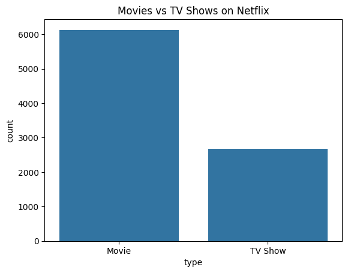
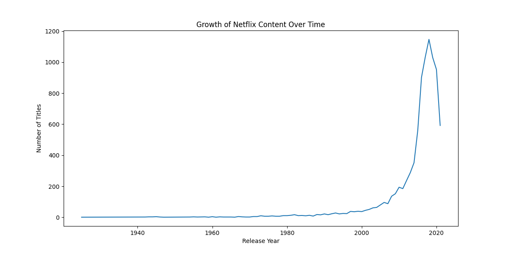
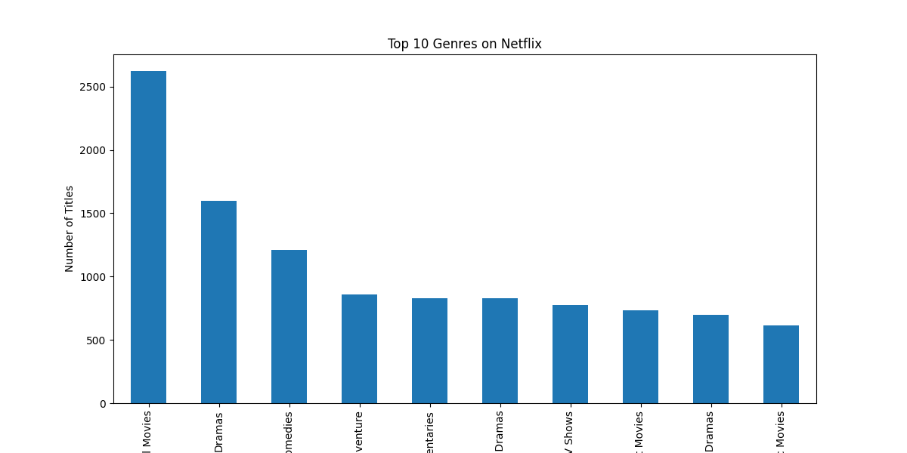
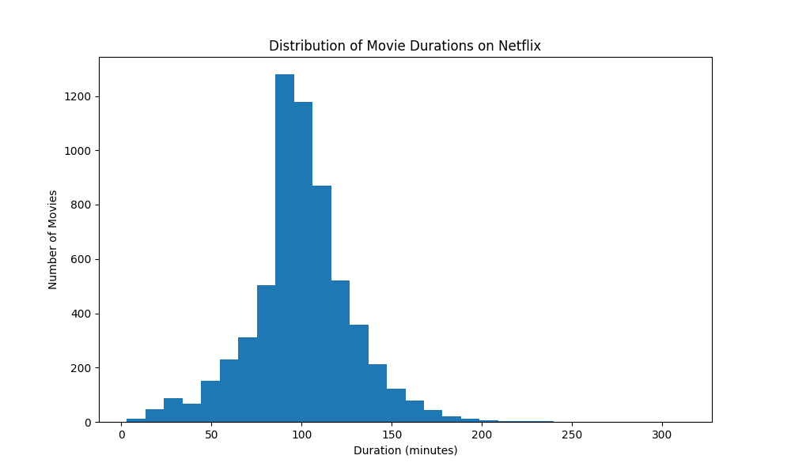

# Netflix Content Analysis: Understanding Choice Fatigue

## Overview
Python data analysis project exploring Netflix’s content catalog and how rapid growth may contribute to viewer choice fatigue.

During a second-year business course at Simon Fraser University, interviews with Netflix users revealed a recurring issue known as **choice fatigue**. Many users reported feeling overwhelmed by the number of titles available when browsing the platform.

This project analyzes Netflix’s content catalog to explore how the growth and structure of the platform’s library may contribute to this experience. Using Python and data analysis techniques, the project examines trends in content growth, genre distribution, global production, and movie durations.

---

## Tools Used

- Python
- Pandas
- Matplotlib
- Seaborn
- Jupyter Notebook
- Git & GitHub

---

## Dataset

The dataset used in this project is the **Netflix Movies and TV Shows dataset** from Kaggle.  
It contains information on over 8,000 Netflix titles, including:

- Title
- Type (Movie or TV Show)
- Country
- Genre
- Release Year
- Duration

---

# Key Analyses

## 1. Movies vs TV Shows Distribution

This visualization compares the number of movies and TV shows available on Netflix.  
The dataset shows that **movies make up the majority of Netflix’s catalog**, indicating that the platform still heavily relies on film content despite the growing popularity of streaming series.

---

## 2. Growth of Netflix Content Over Time

This chart shows how Netflix’s content catalog has expanded over time.  
The platform experienced **rapid growth after 2015**, when Netflix significantly increased its investment in original productions and global content acquisition.

This dramatic expansion means users are now presented with **thousands of viewing options**, which may contribute to the sense of choice fatigue.

---

## 3. Genre Distribution

The genre analysis reveals that **International Movies, Drama, and Comedy** dominate Netflix’s catalog.

This concentration of titles within a few popular genres means users are often presented with many similar options when browsing the platform.

---

## 4. Movie Duration Distribution

The distribution of movie durations shows that most Netflix movies fall between **80 and 120 minutes**, which aligns with the traditional feature film length.

Understanding duration patterns can help streaming platforms optimize content recommendations based on viewer preferences and available viewing time.

---

# Key Insights

From this analysis, several patterns emerge:

- Netflix’s content catalog has **grown rapidly since 2015**
- **Movies dominate** the platform’s library
- **International content plays a major role** in the catalog
- A few genres dominate the majority of titles
- Most films follow the **standard 90–120 minute runtime**

These trends highlight how the **size and structure of Netflix’s catalog may contribute to user choice fatigue** when browsing for content.

---

# Future Work

Further analysis could explore:

- Netflix recommendation systems
- Viewer behavior and engagement
- Genre popularity over time
- Regional content consumption patterns

These areas could provide deeper insight into how streaming platforms can reduce decision overload for users.

---

# Author

**Madelina Adau Garang**  
Computer Science Student  
Simon Fraser University

Interests: Data Analytics, Technology, and Using Data to Solve Real-World Problems
